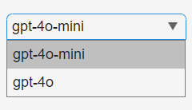

# Build your own chatbot with MATLAB 🤖

In this tutorial you will discover the main APIs that OpenAI provides to
interact with their GPT models. As an application of your learning, you
will build your very first chatbot with MATLAB. It will look like this:


*Figure 1 Your first
chatbot app*

# Contents

* [Setting up the Programming Environment](#setting-up-the-programming-environment)
    * [Connect "LLMs with MATLAB"](#connect-llms-with-matlab)
    * [API Keys and Authentication (For OpenAI)](#api-keys-and-authentication-for-openai)
    * [Test Installation](#test-installation)
* [Quick tour of the OpenAI developer platform](#quick-tour-of-the-openai-developer-platform)
* [Getting started with the chat completion API](#getting-started-with-the-chat-completion-api)
* [Prices of the API](#prices-of-the-api)
* [Build your first chatbot app](#build-your-first-chatbot-app)
    * [Graphical Components](#graphical-components)
    * [Chat Elements](#chat-elements)
    * [User Data](#user-data)
    * [Response Streaming](#response-streaming)
* [Resources](#resources)

## Setting up the Programming Environment

This section will guide you through the necessary library and
step-by-step setup process. I'll take as assumption that you are running
on a Windows machine. Wherever there is a major difference in OS, I'll
try to make sure that I give explanations for the different platforms.

Run the following line of code to automate the next two steps:

`>> setup`

### Connect "LLMs with MATLAB"

Large Language Models (LLMs) with MATLAB[^1] (a.k.a. "LLMs with MATLAB")
is the official library provided by MathWorks for interacting with the
OpenAI APIs as well as other LLMs. There are two ways you can install
this library manually or programmatically:

1.  Go to "Add-Ons" in the Home tab of MATLAB interface to open the
    Add-On Explorer.

2.  Search "Large Language Models (LLMs) with MATLAB".

3.  Click "Add" to install the package.

4.  Add it manually to your MATLAB path:

 

Or

```matlab
folderName = 'llms-with-matlab';

if ~isfolder(folderName)

gitclone("github.com/matlab-deep-learning/llms-with-matlab");

else

disp('The folder already exists.');

end

addpath(genpath("llms-with-matlab")
```
### API Keys and Authentication (For OpenAI)

Obtain an API key from OpenAI by registering on their platform. Set up
the authentication to OpenAI by adding your API key to your environment
variables with an .env file.

1.  Create a new file in the editor:
    `>> edit .env`

2.  Type *OPENAI_API_KEY=<your key>* and save it as an .env file (the file won't appear by default in the file browser in MATLAB Online,
    but you can change this setting)

3.  Load your API key every time you start a new MATLAB session: `>> load(".env")`

4.  Retrieve your API key: `>> getenv("OPENAI_API_KEY")`

### Test Installation

Verify your setup by running a small script to interact with the OpenAI
API.

```matlab
addpath("path/to/llms-with-matlab");

loadenv("path/to/.env");

client = openAIChat( ...

ApiKey=getenv("OPENAI_API_KEY"), ...

ModelName="gpt-4o-mini");

res = generate(client,"Say this is a test")
```

## Quick tour of the OpenAI developer platform

First you will need to create an OpenAI account on their developer
platform (*platform.openai.com*). Once you are logged in to your OpenAI
account, the landing page of the developer platform will take you to a
playground that enables you to get access to different kinds of models.
The main kind of models are chat models on which I will focus for this
chapter. But you will see other kinds of models in the rest of the book,
like the Assistant and TTS (Text-To-Speech) models. Completion models
are now considered legacy.


*Figure 2 Play around in
the playground and test the model APIs*

This will give you an experience close to the one you have with the
ChatGPT web app. But from there you will be able to access more advanced
parameters of the model and view the code necessary to replicate the
call to the API from your own program. If you are lacking inspiration,
and you don't know where to start, you will find some prompt examples
from the presets in the documentation[^2].


*Figure 3 Prompt examples*

If you want to take a guided look at the documentation[^3] before trying
anything or go lower level to the definition of the functions in the API
reference[^4].

Finally you can also access a dashboard to access management services:

-   *Assistants*: to create and manage your own assistant models

-   *Fine-tuning*: to fine-tune your own models

-   *Batches*: to manage your batch jobs

-   *Storage*: to manage files and vector stores

-   *Usage*: to give you a sense of your consumption of the OpenAI web
    services.

-   *API keys*: to manage your API keys

**/!\\** As an important data privacy disclaimer, API and
Playground requests will not be used to train OpenAI models. This isn't
the case of the public ChatGPT App, which by default can learn from
users' conversations.

## Getting started with the chat completion API

A message to the chat completion API is made up of role and content.
There are three distinct roles: system, user, and assistant.

-   *System*: This is the initial instruction for the LLM that guides
    its subsequent responses and actions, known as "system prompt". It
    serves as context for the rest of the conversation, forcing the chat
    to behave in a certain way. Some developers have found success in
    continually moving the system message near the end of the
    conversation to keep the model's attention from drifting away as
    conversations get longer. You can set the system prompt when you
    initialize openAIChat.

```matlab
% Load environment variables and initialize the chat client with a
system prompt

loadenv("path/to/.env");

chat = openAIChat("If I say hello, say world", ...

ApiKey=getenv("OPENAI_API_KEY"), ...

ModelName="gpt-4o-mini");
```
-   *User*: This is the prompt a user provides to the LLM.

-   *Assistant*: This is the response from the LLM.

To add your prompt, initialize OpenAIMessages and use addUserMessage to
add your message.
```matlab
% Initialize message history and add a user query

messages = messageHistory;

messages = addUserMessage(messages,"hello");

[txt,msgStruct,response] = generate(chat,messages);

disp(txt) % world
```
We can add the response to the messages using addResponseMessage to
continue the conversation without losing the previous exchanges.
```matlab
messages = addResponseMessage(messages, msgStruct);
```
Here is the content of messages:
```matlab
>> messages.Messages{1}

ans =

struct with fields:

role: "user"
content: "hello"

>> messages.Messages{2}

ans =

struct with fields:

role: "assistant"
content: "world"
```
As you can see from the messages object passed to the OpenAI chat
client, it consists of a cell array of struct, each entry containing a
role (either *user* or *assistant*) and a content entry.

Let's save the messages in a .mat file in a "chat" folder for later use:
```matlab
save(fullfile("chat","convo1.mat"),"messages");
```
You can convert the messages to a table for better visualization:
```matlab
% Display the message history as a table

msgCells = messages.Messages;

msgStructArray = [msgCells{:}];

T = struct2table(msgStructArray);

disp(T)
```
The table output will look like:

*Table 1 Chat History*

| role | content |
|------|---------|
| user | hello |
| assistant | world |

The messages can contain as many *user* and *assistant* exchanges as you
want, as long as you do not exceed the model's context window. For
GPT-4o[^5], the number of tokens accepted is 128k. Inputs and outputs
tokens are summed, but outputs cannot exceed 16,385 tokens.

Additional parameters can be passed when creating the OpenAI Chat client
or generating a response (like max number of tokens, number of responses
to generate, and streaming option).

## Prices of the API

The prices[^6] have evolved quite a bit since the introduction of the
ChatGPT API. As of the time of this writing (gpt-4o-2024-11-20):

*Table 2 Prices of the API*

| model | input price ($\$ per 1M tokens$) | output price ($\$ per 1M tokens$) |
|-------|----------------------------------|-----------------------------------|
| gpt-4o-mini | $0.150 | $0.600 |
| gpt-4o | $2.5 | $10 |

**/!\\** Make sure to check the latest prices of the API,
and consider how you could be submitting your request as a *batch*[^7].
Responses will be returned within 24 hours for a 50% discount. If some
of your input tokens are repeated across requests, they will be
automatically *cached*[^8] giving you 50% discount compared to uncached
prompts.

To give you a sense of the cost of using the API on a daily basis, here
is a view over the month of May, where I spend the most of my time
writing this book and developing the associated GPTs.


*Figure 4 Cost of OpenAI
services over the period of a busy month*

If you hover over the graphic, you can see the breakdown by service
(image, audio, embeddings, ...) or by model (3.5, 4o, ...). The big
spike mid-month was due to the Dall-E 3 service usage for over \$5 on 1
day.


*Figure 5 Breakdown of the
cost per service*

You can add email alerts and set budget limits to control your spending.
As I started integrating more AI into my apps over the year, I ended up
creating new keys for each project, and even distributing keys to
friends and colleagues:


*Figure 6 Table of active
OpenAI keys*

This enabled me to have a finer grain control over the different
projects including AI. You now have the ability to actually create a
"project" that can contain members and have dedicated limits attached to
it

## Build your first chatbot app

In this section, you will learn how to build your very first chatbot
application, leveraging the OpenAI APIs. You will start by experiencing
the basics of building applications in MATLAB. The resulting app is
stored on GitHub in the file *chatbot.m,* and I will walk you step by
step through the development of such an app.

I will break down the development of the chatbot into the following
steps:

1.  *Graphical components*: Define the basic user interactions with the
    app

2.  *Chat elements*: Display the chat conversation as a table in the
    main area, and implement convenience functions to save and load the
    chat history

3.  *User data*: Store the state of your app in a user variable to
    simplify the interaction schema

4.  *Response streaming*: Display the response as it is being generated

### Graphical Components

This part is going to focus more on the MATLAB app-building framework.
Typically, we use App Designer[^9] to design MATLAB apps interactively.
You can also create simple apps programmatically. Let's start with that
approach. Figure 2-7 represents a simple app built in a MATLAB UI figure
window.


*Figure 7 Simple chat user
interface*

This is the code for the first chat Graphical User Interface in MATLAB:
```matlab
% create a UI figure window

fig = uifigure(Name="My first chatbot");

% add a 7x4 grid

g = uigridlayout(fig);

g.RowHeight = {'1x',22,22,22,22,22,'1x'};

g.ColumnWidth = {150,300,50,'1x'};

% add a title

ttl = uilabel(g,Text="My first chatbot 🤖");

ttl.HorizontalAlignment = "center";

ttl.FontSize = 24;

ttl.Layout.Row = 1;

ttl.Layout.Column = [1,3];

% add an input field

eflabel = uilabel(g,Text="Enter your message");

eflabel.Layout.Row = 2;

eflabel.Layout.Column = 2;

ef = uieditfield(g);

ef.Layout.Row = 3;

ef.Layout.Column = [2,3];

ef.Value = "Hello";

% add an output field

oflabel = uilabel(g,Text="Response");

oflabel.Layout.Row = 5;

oflabel.Layout.Column = 2;

of = uieditfield(g);

of.Layout.Row = 6;

of.Layout.Column = [2,3];

% add a button

btn = uibutton(g,Text="Send") ;

btn.ButtonPushedFcn=@(src,event) chat(ef,of);

btn.Layout.Row = 4;

btn.Layout.Column = 3;

% this function runs when the button is clicked

function chat(inputField,outputField)

systemPrompt = "If I say hello, say world";

% modify this depending on which release you use

client = openAIChat(systemPrompt, ...

ModelName="gpt-4o-mini");

% ApiKey=getenv("OPENAI_API_KEY")

prompt = string(inputField.Value);

[txt,msgStruct,response] = generate(client,prompt);

if isfield(response.Body.Data,"error")

error(response.Body.Data.error)

else

outputField.Value = txt;

end

end
```
You will need to define all the local functions at the end of the script
file unless you use R2024a or later (In the latest versions of MATLAB,
you can define local functions anywhere in a script).

MATLAB apps are built on a UI figure[^10] window. It is a good practice
to add a UI grid layout[^11] to the UI figure to organize UI components
within the UI figure.

The basic elements that are useful for any basic app are the UI edit
field[^12] and the UI button[^13], which lets you define the app
behavior in a callback function.

As mentioned in the preface section about authentication, the API key is
stored locally in a file *.env*. and loaded via the *setup.mlx* file. You also need to make sure that the LLMs-with-MATLAB repo is
on the MATLAB path, as well as its subfolder, as part of the setup.

We can gradually increase the complexity of the app, by adding a UI
dropdown[^14] to choose the model ***before*** the UI button definition:
```matlab
% add a dropdown before the button

items = ["gpt-4o-mini","gpt-4o"];

dd = uidropdown(g,Items=items);

dd.Layout.Row = 2;

dd.Layout.Column = 1;
```


*Figure 8 Model selection
with drop-down menu*

You also need to update the callback function in the UI button to
include the UI dropdown to the input arguments.
```matlab
% update the callback input arguments

btn.ButtonPushedFcn=@(src,event) chat(dd,ef,of));

Here is the updated function definition:

function chat(selection,inputField,outputField)

systemPrompt = "If I say hello, say world";

% modify this depending on which release you use

client = openAIChat(systemPrompt, ...

ApiKey=getSecret("OPENAI_API_KEY"), ...

ModelName=selection.Value);

prompt = string(inputField.Value);

[txt,msgStruct,response] = generate(client,prompt);

if isfield(response.Body.Data,"error")

error(response.Body.Data.error)

else

outputField.Value = txt;

end

end
```
A drop-down element hides the selection to only reveal the selected
option. An alternative way to display multiple choices is to use radio
buttons. This other type of graphical component enables a finite number
of choice options to be displayed for an exclusive selection of one only
(unlike checkboxes that enable multiple choices).

### Chat Elements

The simple app you just built can only handle a single-turn chat. To
support a multi-turn chat, you need to use a UI component that can show
multiple lines of text. One such component is the UI table[^15].
```matlab
% create a ui figure window

fig = uifigure(Name="My conversation table");

% set the figure size

fig.Position(end) = 150;

% add a 3x1 grid

g = uigridlayout(fig,[3,1]);

g.RowHeight = {80,22,'1x'};

% add a table

uit = uitable(g);

uit.Data = ["user","hello";"assistant","world"];

uit.ColumnName = ["Role","Content"];

uit.Layout.Row = 1;

% add an input field

ef = uieditfield(g,Placeholder="Enter your message");

ef.Layout.Row = 2;
```
As you can see from the structure of the code, the rendering of the
messages will be done after a new message has been added to the Data
property of the UI table. Please note that the input field is placed
below the table with a placeholder text.


*Figure 9 A basic chat
dialog*

In order to start building a chat that has more than one question and
one answer (not much of a chat), you will save the conversation and load
it back (making the app stateless and relying on storing the history to
disk).

First let's start by loading an existing conversation, with a function
called *load_chat* that loads a chat history for debugging:
```matlab
function load_chat(listbox, outputField)

historyfile = fullfile("chat", listbox.Value + ".mat");

if isfile(historyfile)

load(historyfile, "convo");

roles = cellfun(@(x) string(x.role), convo.Messages');

contents = cellfun(@(x) string(x.content), convo.Messages');

outputField.Data = [roles, contents];

else

outputField.Data = [];

end

end
```
The chat history is stored in a .mat file in the chat folder. The chat
history is loaded from the file and then displayed in the output field.

You also need a function to populate a listbox with available filenames.
```matlab
function list_history(inputField)

if isfolder("chat")

s = dir("chat");

isMat = arrayfun(@(x) endsWith(x.name, ".mat"), s);

filenames = arrayfun(@(x) string(x.name), s(isMat));

else

mkdir("chat");

filenames = [];

end

items = "Select a conversation";

if ~isempty(filenames)

filenames = extractBefore(filenames, ".mat");

items = [items, filenames'];

end

inputField.Items = items;

end
```


*Figure 10 Conversation
history stored as mat file*

You can call those functions as follows.
```matlab
% Chatbot with history

% Create the uifigure with minimal width.

initialHeight = 420; initialWidth = 610;

fig = uifigure("Name", "ChatGPT-like bot");

fig.Position = [100 100 initialWidth initialHeight];

% Add an 8x5 grid layout

g = uigridlayout(fig);

g.RowHeight = {'1x',22,22,22,'5x',22,22,5};

g.ColumnWidth = {150,100,200,'1x',100};

% Title label

ttl = uilabel(g, "Text", "ChatGPT-like bot 🤖");

ttl.FontSize = 24;

ttl.Layout.Row = 1;

ttl.Layout.Column = [1,5];

ttl.HorizontalAlignment = "center";

% Table to show the conversation

uit = uitable(g);

uit.ColumnWidth = {100, '1x'};

uit.ColumnName = ["Role", "Content"];

uit.Layout.Row = [2,6];

uit.Layout.Column = [2,5];

% Dropdown for conversation history

dd = uidropdown(g);

list_history(dd);

dd.ValueChangedFcn = @(src,event) load_chat(dd, uit);

dd.Layout.Row = 3;

dd.Layout.Column = 1;
```
Second let's define the chat function. While designing the behavior of
the app, I'd recommend avoid calling OpenAI each time by creating a
dummy chat function:
```matlab
function dumb_chat(inputField, dropdown, convo)

prompt = string(inputField.Value);

convo = addUserMessage(convo, prompt);

txt = "Hello world";

msgStruct = struct("role", "assistant", "content", txt);

convo = addResponseMessage(convo, msgStruct);

save_chat(convo, "convo0");

list_history(dropdown);

end
```
You need to output the conversation outside of the function. However,
this function is called from a button click, so there is no direct way
to output the conversation to use elsewhere. To solve this problem, you
save the conversation to a local file using the save_chat function:
```matlab
function save_chat(convo, filename)

historyfile = fullfile("chat", filename + ".mat");

save(historyfile, "convo");

end
```
You can implement additional UI components and logic to accept user
input and save the conversation to a file.
```matlab
% Input field for messages

ef = uieditfield(g, Placeholder="Enter your message.");

ef.Layout.Row = 7;

ef.Layout.Column = [2,4];

% Send button for the chat (run button)

sendBtn = uibutton(g, Text="Send");

sendBtn.ButtonPushedFcn = @(src,event) dumb_chat(ef, ld,
openAIMessages);

sendBtn.Layout.Row = 7;

sendBtn.Layout.Column = 5;
```
When you send your message by clicking on the button, the conversation
is saved in the "convo1.mat" file and you can display it by selecting
"convo1" in the dropdown.

### User Data

In the previous section, you have seen how to save and load a
conversation. But you don't really want to be writing to disk every
element of our app that needs to store a state. When you design an app,
you need to store app data to be shared across various callback
functions. The best way to store data is to use the UserData property of
the top-level UI figure, because it is accessible from all other UI
components. In our example, you need to manage the state of the
conversation as it is loaded, updated and saved.

By storing the conversation in the UserData property of the UI figure,
you can access it from any child component using ancestor[^16] function:
```matlab
fig = ancestor(uicomponent,"figure","toplevel");

fig.UserData
```
Let's see how this works in the updated dumb_chat function:
```matlab
function dumb_chat(inputField,outputField)

% use ancestor to get the fig

fig = ancestor(inputField,"figure","toplevel");

% get the messages from the UserData property of the fig

convo = fig.UserData;

prompt = string(inputField.Value);

if isempty(outputField.Data)

outputField.Data = ["user",prompt];

else

outputField.Data = [outputField.Data;"user",prompt];

end

convo = addUserMessage(convo,prompt);

txt = "Hello world";

msgStruct = struct("role","assistant","content",txt);

convo = addResponseMessage(convo,msgStruct);

% update the UserData property of the fig

fig.UserData = convo;

outputField.Data = [outputField.Data;"assistant",txt];

inputField.Value = "";

end
```
The save_chat function is no longer used in the dumb_chat function.
Let's repurpose it so that it can be called from a button.
```matlab
function save_chat(inputField,outputField)

fig = ancestor(inputField,"figure","toplevel");

convo = fig.UserData;

if ~isempty(convo.Messages)

% create a new filename based on the folder content

s = dir("chat");

isMat = arrayfun(@(x) endsWith(x.name,".mat"), s);

filenames = arrayfun(@(x) string(x.name), s(isMat));

if isempty(filenames)

filename = "convo1";

else

filenames = extractBefore(filenames,".mat");

suffix = str2double(extractAfter(filenames,"convo"));

filename = "convo" + (max(suffix) + 1);

end

historyfile = fullfile("chat", filename + ".mat");

save(historyfile,"convo");

list_history(inputField);

end

% reset the UserData and output field

fig.UserData = openAIMessages;

outputField.Data = [];

end
```
Then you need to initialize the UserData property of the UI figure when
you build the app:
```matlab
% initialize the UserData property in the UI figure

fig = uifigure(Name="ChatGPT-like bot");

fig.UserData = openAIMessages;

Let's add a new button that called the save_chat function before the
"Send" button.

% add a save chat button

saveBtn = uibutton(g,Text="Save Chat");

saveBtn.ButtonPushedFcn=@(src,events) save_chat(uit,dd);

saveBtn.Layout.Row = 4;

saveBtn.Layout.Column = 1;
```
You also need to update the input arguments for the callback function
for the input field:
```matlab
% modify the function input arguments

sendBtn.ButtonPushedFcn=@(src,event) dumb_chat(ef,uit);
```
### Response Streaming

Finally, one small thing is missing to make the app look and feel just
like ChatGPT. You will modify the call to the OpenAI chat completion
API, by adding the parameter StreamFun.

Setting StreamFun in a client makes the model return tokens as soon as
they are available, instead of waiting for the full sequence of tokens
to be generated. It does not change the time to get all the tokens, but
it reduces the time for the first token for an application where you
want to show partial progress or are going to stop generations. This can
be a better user experience and a UX improvement so it's worth
experimenting with streaming.

Here is the code that replaces the dumb_chat function:
```matlab
function chat_stream(dropdown,inputField,outputField)

% modify this depending on which release you use

client = openAIChat(ModelName=dropdown.Value, ...

ApiKey=getSecret("OPENAI_API_KEY"), ...

StreamFun=@(x) printStream(outputField,x));

fig = ancestor(inputField,"figure","toplevel");

convo = fig.UserData;

prompt = string(inputField.Value);

if isempty(outputField.Data)

outputField.Data = ["user",prompt];

else

outputField.Data = [outputField.Data; "user",prompt];

end

convo = addUserMessage(convo,prompt);

[txt,msgStruct,response] = generate(client,convo);

convo = addResponseMessage(convo,msgStruct);

if isfield(response.Body.Data,"error")

error(response.Body.Data.error)

else

fig.UserData = convo;

outputField.Data(end) = txt;

inputField.Value = "";

end

end
```
Additionally, you need to define the function for the StreamFun
parameter:
```matlab
function printStream(h,x)

data = string(h.Data);

if strlength(x) == 0

data = [data; "assistant",string(x)];

else

data(end) = data(end) + string(x);

end

h.Data = data;

pause(0.1)

end
```
Let's update the dropdown so that you can use it to choose a model:
```matlab
% replace the dropdown

ddlabel = uilabel(g,Text="Select an OpenAI model");

ddlabel.Layout.Row = 2;

ddlabel.Layout.Column = 1;

dd = uidropdown(g,Items=["gpt-4o-mini","gpt-4o"]);

dd.Layout.Row = 3;

dd.Layout.Column = 1;

% replace dumb_chat with chat_stream

sendBtn.ButtonPushedFcn=@(src,events) chat_stream(dd,ef,uit);
```
Now you should be able to stream the response from the API.

Before you finish, you need to make one more change. Since you updated
the dropdown to select a model, you lost the ability to load a chat
history. Let's add a few more things to complete the app.
```matlab
% add a listbox

lb = uilistbox(g);

list_history(lb);

lb.ValueChangedFcn = @(src,events) load_chat(lb,uit);

lb.Layout.Row = [5,7];

lb.Layout.Column = 1;
```
You also need to update some functions.
```matlab
function load_chat(listbox,outputField)

historyfile = fullfile("chat", listbox.Value + ".mat");

if isfile(historyfile)

load(historyfile,"convo");

fig = ancestor(outputField,"figure","toplevel");

fig.UserData = convo;

roles = cellfun(@(x) string(x.role), convo.Messages');

contents = cellfun(@(x) string(x.content), convo.Messages');

outputField.Data = [roles,contents];

else

outputField.Data = [];

end

end
```
Congratulations 🎉 You have created your first chatbot. If you assemble
the learnings from the previous sections, you will be able to replicate
the code in this example in *chatbot.m*.

## Resources

This tutorial is getting inspiration from:

-   <https://github.com/toshiakit/MatGPT>

-   <https://github.com/yanndebray/programming-GPTs>

[^1]: [github.com/matlab-deep-learning/llms-with-matlab](https://github.com/matlab-deep-learning/llms-with-matlab)

[^2]: Prompt examples: [https://platform.openai.com/docs/examples](https://platform.openai.com/docs/examples)

[^3]: Doc: [platform.openai.com/docs](https://platform.openai.com/docs/overview)

[^4]: API Reference: [platform.openai.com/api-reference](https://platform.openai.com/api-reference)

[^5]: <https://platform.openai.com/docs/models/gpt-4o>

[^6]: <https://openai.com/api/pricing>

[^7]: <https://platform.openai.com/docs/guides/batch>

[^8]: <https://platform.openai.com/docs/guides/prompt-caching>

[^9]: <https://www.mathworks.com/help/matlab/app-designer.html>

[^10]: <https://www.mathworks.com/help/matlab/ref/uifigure.html>

[^11]: <https://www.mathworks.com/help/matlab/ref/uigridlayout.html>

[^12]: <https://www.mathworks.com/help/matlab/ref/uieditfield.html>

[^13]: <https://www.mathworks.com/help/matlab/ref/uibutton.html>

[^14]: <https://www.mathworks.com/help/matlab/ref/uidropdown.html>

[^15]: <https://www.mathworks.com/help/matlab/ref/uitable.html>

[^16]: <https://www.mathworks.com/help/matlab/ref/ancestor.html>
